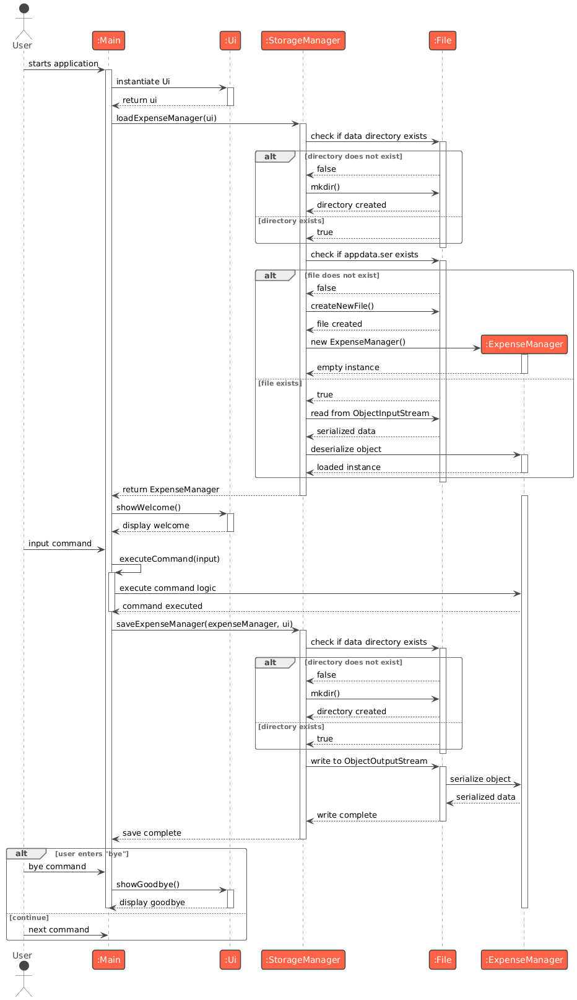
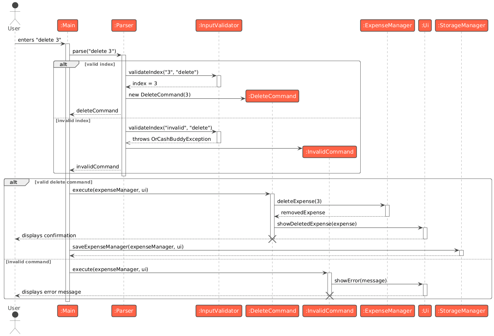
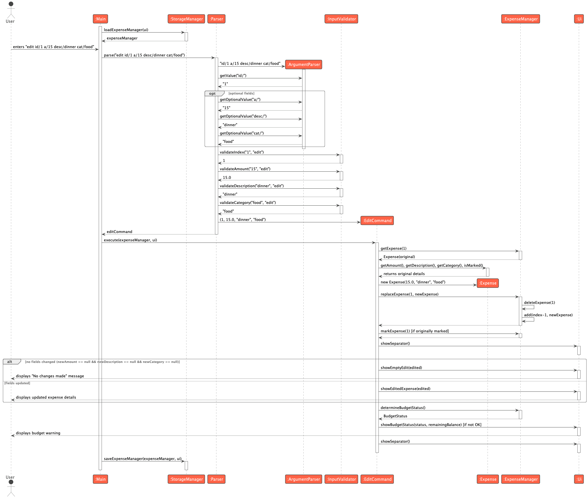
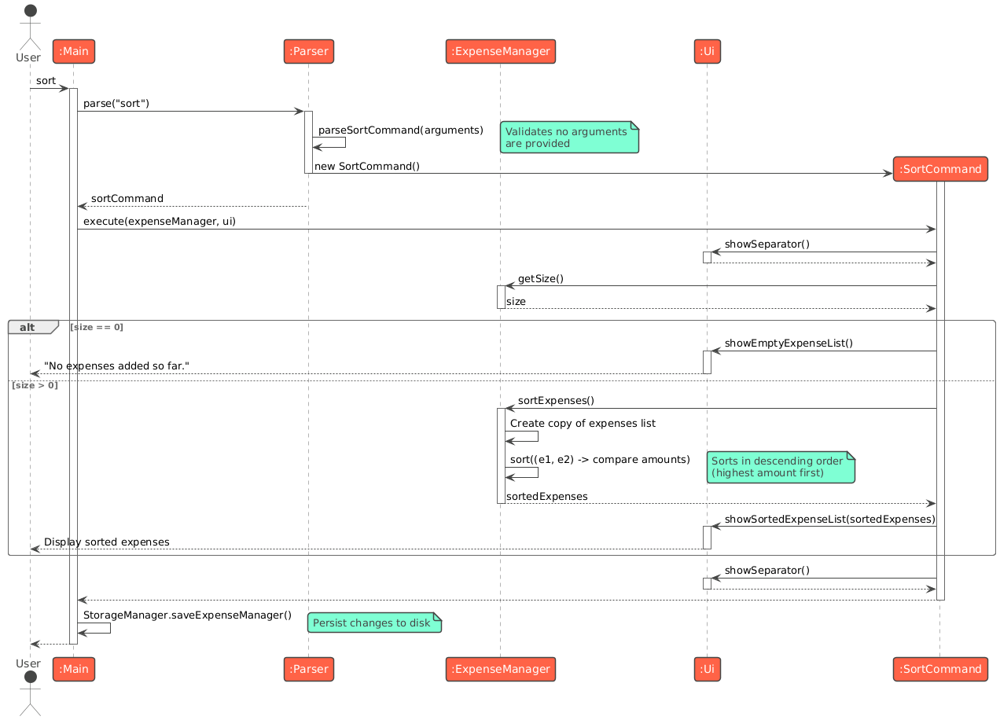
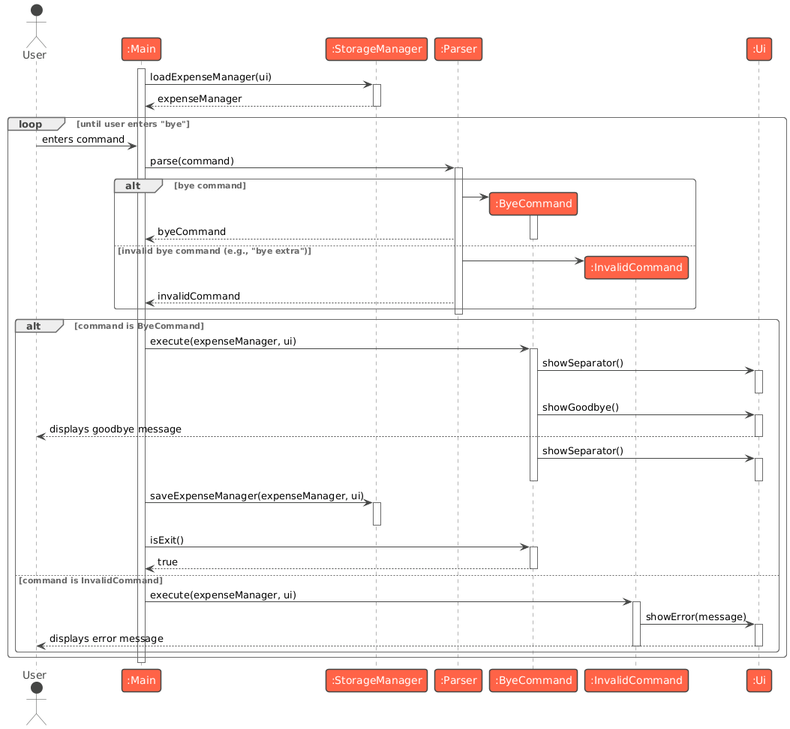
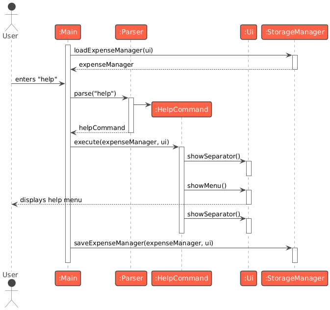
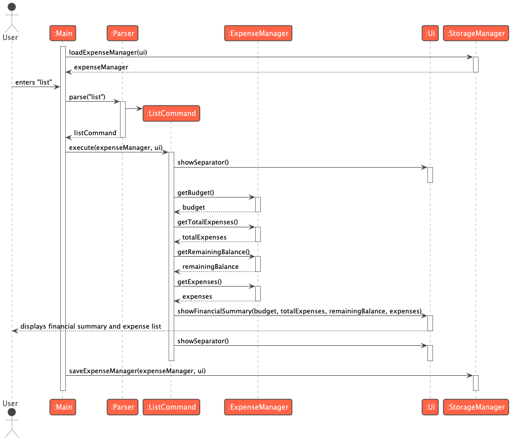

# Developer Guide

This Developer Guide (DG) introduces the internals of **orCASHbuddy**, outlines design decisions, and documents how to extend, test, and deploy the project. It is written for developers who will maintain or enhance the application.

---

## Acknowledgements

- Command pattern architecture, testing strategy, and documentation structure were adapted from the [AddressBook-Level3](https://se-education.org/addressbook-level3/) (AB3) teaching codebase.
- orCASHbuddy was bootstrapped from the CS2113 template project.

---

## Table of Contents

1. [Introduction](#introduction)
2. [Setting Up](#setting-up)
3. [Design](#design)
   1. [UI Component](#ui-component)
   2. [Logic Component](#logic-component)
   3. [Model Component](#model-component)
   4. [Storage Component](#storage-component)
4. [Implementation](#implementation)
   1. [Add Expense Feature](#add-expense-feature)
   2. [Set Budget Feature](#set-budget-feature)
   3. [Mark/Unmark Expense Feature](#markunmark-expense-feature)
   4. [Find Expense Feature](#find-expense-feature)
   5. [Delete Expense Feature](#delete-expense-feature)
   6. [Edit Expense Feature](#edit-expense-feature)
   7. [Sort Expenses Feature](#sort-expenses-feature)
   8. [Storage Management Feature](#storage-management-feature)
   9. [Graceful Exit](#graceful-exit)
   10. [Help Feature](#help-feature)
   11. [List Feature](#List-feature)
5. [Appendix A: Product Scope](#appendix-a-product-scope)
6. [Appendix B: User Stories](#appendix-b-user-stories)
7. [Appendix C: Non-Functional Requirements](#appendix-c-non-functional-requirements)
8. [Appendix D: Glossary](#appendix-d-glossary)
9. [Appendix E: Instructions for Manual Testing](#appendix-e-instructions-for-manual-testing)

---

## Introduction

orCASHbuddy is a Java 17 command-line application that helps students track expenses against a lightweight budget without the overhead of spreadsheets. The application uses a command-driven architecture with persistent storage, providing immediate feedback and automatic data saving.

**Key Features:**
- Track expenses with amount, description, and category
- Set and monitor budgets with visual progress indicators
- Mark/unmark expenses as paid for accurate budget tracking
- Search expenses by category or description
- Edit and delete expenses with automatic budget recalculation
- Sort expenses by amount
- Persistent storage using Java serialization

---

## Setting Up

Follow these steps to set up the project in IntelliJ IDEA:

1. **Java 17 Installation:** Ensure Java 17 is installed and configured as an IntelliJ SDK.
2. **Clone Repository:** Clone the repository and open it as a **Gradle** project.
3. **Gradle Dependencies:** Let Gradle finish downloading dependencies. The main entry point is `seedu.orcashbuddy.Main`.
4. **Verify Setup:** Run `Main#main` once to verify that the welcome banner appears in the Run tool window.
5. **Run Tests:** Execute `./gradlew test` (or `gradlew.bat test` on Windows) to confirm all JUnit tests pass.
6. **Code Quality:** Run `./gradlew checkstyleMain checkstyleTest` to verify code style compliance.

---

## Design

### UI Component

**API**: `Ui.java`

The `Ui` class handles all console-based user interactions in orCASHbuddy.

#### Structure of the UI Component


<br>

#### Responsibilities
The `UI` component is responsible for all user-facing interactions in the console. It:

* displays output to the terminal using `System.out.println()`, including expense lists, budget summaries, error messages, and command feedback.
* formats data for readability with visual separators, progress bars, and status icons.
* uses ANSI escape codes to render color-coded budget progress bars (green for safe spending, yellow for approaching limit, red for over budget).
* receives data as method parameters from `Command` objects after execution, making it stateless and purely presentational.
* does not hold references to `ExpenseManager` or other stateful components.
* provides contextual usage hints (via methods like `showAddUsage()`, `showDeleteUsage()`) when invalid commands are entered.

<br>

#### Visual Elements

The `UI` provides several visual aids for better user experience:

**Separators:** Dashed lines (`---------------------------------------------------------------`) create visual boundaries between command outputs.

**Progress Bar:** A fixed-width bar showing budget usage:
```
Budget Used: [=============|----------------]  45.50%  (Remaining: $54.50)
```
- Green (0-70%): Safe spending range
- Yellow (70-100%): Approaching budget limit
- Red (>100%): Over budget

**Status Icons:** Visual markers for expense payment status:
- `[X]` — Marked as paid (included in budget calculations)
- `[ ]` — Not yet paid (planned expense)

**Example Output:**
```
---------------------------------------------------------------
FINANCIAL SUMMARY
Budget set: $100.00
Total expenses: $45.50
Remaining balance: $54.50

BUDGET STATUS
Spent: $45.50 / $100.00
Budget Used: [=============|----------------]  45.50%  (Remaining: $54.50)

Here is your list of expenses:
1. [X] [Food] Lunch - $12.50
2. [ ] [Transport] Bus fare - $3.00
3. [X] [Food] Dinner - $30.00
---------------------------------------------------------------
```

<br>

### Logic Component

**API**: `Parser.java`, `Command.java`

The Logic component is responsible for making sense of user commands.

<br>

#### Key Classes

**Parser (`Parser.java`):**
- Central parsing coordinator that identifies command words and routes to specific parsing methods
- Contains `parseXxxCommand()` methods for each command type (e.g., `parseAddCommand()`, `parseDeleteCommand()`)
- Catches `OrCashBuddyException` during parsing and wraps failures in `InvalidCommand` objects
- Returns a `Command` object ready for execution

**ArgumentParser (`ArgumentParser.java`):**
- Lightweight helper for extracting prefixed argument values from command strings
- Provides `getValue(prefix)` for required arguments (throws exception if missing)
- Provides `getOptionalValue(prefix)` for optional arguments (returns null if absent)
- Handles multiple prefixes in a single command string
- Does not perform semantic validation; only extracts raw string values

**InputValidator (`InputValidator.java`):**
- Static utility class providing validation methods for all input types
- `validateAmount()`: Ensures numeric format and positive value
- `validateDescription()`: Ensures non-empty and trimmed string
- `validateCategory()`: Validates format (alphanumeric, starts with letter, reasonable length)
- `validateIndex()`: Ensures positive integer index for expense operations
- Throws `OrCashBuddyException` with descriptive messages for validation failures

**Command (`Command.java`):**
- Abstract base class for all executable commands
- Defines `execute(ExpenseManager, Ui)` for command execution
- Defines `isExit()` to signal application termination (default: false)
- Subclasses include: `AddCommand`, `DeleteCommand`, `EditCommand`, `MarkCommand`, `UnmarkCommand`, `FindCommand`, `SortCommand`, `ListCommand`, `SetBudgetCommand`, `HelpCommand`, `ByeCommand`, `InvalidCommand`

**InvalidCommand (`InvalidCommand.java`):**
- Special command type for handling parsing/validation failures
- Stores the `OrCashBuddyException` that caused the failure
- Displays contextual usage hints based on error message content (e.g., shows add usage for add-related errors)
- Prevents application crash when user provides malformed input

**OrCashBuddyException (`OrCashBuddyException.java`):**
- Custom exception type for application-specific errors
- Provides factory methods for common error scenarios (e.g., `missingAmountPrefix()`, `invalidExpenseIndex()`)
- Contains descriptive error messages for user feedback
- Used throughout parsing and validation to signal failures

<br>

#### How the Logic component works:

1. When `Logic` is called upon to execute a command (via `Main#executeCommand()`), the input is passed to a `Parser` object.
2. The `Parser` splits the input into a command word and arguments, then uses `ArgumentParser` to extract prefixed values (e.g., `a/`, `desc/`, `cat/`).
3. `InputValidator` validates each extracted parameter (e.g., ensuring amounts are positive, descriptions are non-empty).
4. The `Parser` creates the appropriate `Command` object (e.g., `AddCommand`, `DeleteCommand`) populated with validated data.
5. This results in a `Command` object which is executed by `Main` via `command.execute(expenseManager, ui)`.
6. The command can communicate with the `Model` when it is executed (e.g., to add an expense, mark as paid, or delete an entry). The command may also display results via the `Ui`.
7. After execution, `Main` automatically saves the updated state via `StorageManager`.
8. If the command is `ByeCommand`, it returns `true` from `isExit()`, signaling `Main` to terminate the application loop.

<br>

#### How the parsing works:

* When called upon to parse a user command, the `Parser` class identifies the command word (e.g., `add`, `delete`, `mark`).
* For each command type, `Parser` has a corresponding `parseXxxCommand()` method (e.g., `parseAddCommand()`, `parseDeleteCommand()`) that:
    - Uses `ArgumentParser` to extract required and optional prefixed arguments
    - Delegates validation to `InputValidator`
    - Constructs the specific `Command` object (e.g., `AddCommand`, `MarkCommand`)
* If parsing or validation fails, `Parser` catches `OrCashBuddyException` and wraps it in an `InvalidCommand` object.
* The `InvalidCommand`, when executed, displays contextual error messages and usage hints via `Ui` (e.g., `showAddUsage()`, `showDeleteUsage()`).

**Example: Parsing an Add Command**

```
User Input: "add a/25.50 desc/Dinner cat/Food"
     ↓
Parser identifies command word: "add"
     ↓
Parser.parseAddCommand() called with arguments: "a/25.50 desc/Dinner cat/Food"
     ↓
ArgumentParser extracts: amount="25.50", description="Dinner", category="Food"
     ↓
InputValidator validates each field:
  - amount=25.50 (positive ✓)
  - description="Dinner" (non-empty ✓)
  - category="Food" (valid format ✓)
     ↓
Parser creates: AddCommand(25.50, "Dinner", "Food")
     ↓
Main executes: command.execute(expenseManager, ui)
```

<br>

#### Error Handling

When parsing or validation fails:
1. `ArgumentParser` or `InputValidator` throws `OrCashBuddyException` with descriptive message
2. `Parser` catches the exception and creates `InvalidCommand(exception)`
3. `Main` executes `InvalidCommand#execute()`, which displays contextual usage help via `Ui`
4. Application continues running without disruption

**Example Error Flow:**
```
User Input: "add desc/Lunch"  (missing amount)
     ↓
ArgumentParser throws: OrCashBuddyException("Missing prefix: a/")
     ↓
Parser creates: InvalidCommand(exception)
     ↓
Main executes: InvalidCommand#execute()
     ↓
Ui displays: "Invalid format. Use: add a/AMOUNT desc/DESCRIPTION [cat/CATEGORY]"
```

<br>

#### Design Considerations

**Why separate ArgumentParser and InputValidator?**
- **Separation of Concerns:** Extraction logic (ArgumentParser) separate from validation logic (InputValidator)
- **Reusability:** InputValidator methods can be called independently for any validation needs
- **Testability:** Each component can be unit tested in isolation
- **Clarity:** Clear distinction between "finding the value" vs "checking if it's valid"

**Why use factory methods in OrCashBuddyException?**
- **Consistency:** Ensures consistent error message formatting
- **Maintainability:** Centralized error message management
- **Type Safety:** Compile-time checking of exception creation
- **Discoverability:** IDE autocomplete shows available exception types

**Why InvalidCommand instead of throwing exceptions?**
- **Graceful Recovery:** Application continues running after invalid input
- **User Experience:** Provides helpful usage hints instead of cryptic stack traces
- **Command Pattern Consistency:** All parsing outcomes return Command objects
- **Error Context:** Preserves exception information for contextual feedback

<br>

### Model Component

**API**: `ExpenseManager.java`, `Expense.java`

#### Responsibilities
The `Model` component represents the application's core data and business logic. It:
* stores the expense tracking data, i.e., all `Expense` objects (which are contained in a `List<Expense>` within `ExpenseManager`).
* stores the budget and financial tracking state: `budget` (user-set spending limit), `totalExpenses` (sum of marked expenses), and `remainingBalance` (budget - totalExpenses).
* enforces business rules and maintains invariants (e.g., budget must be positive, expenses must have valid amounts and descriptions, balance must equal budget minus total expenses).
* exposes operations for expense management (`addExpense`, `deleteExpense`, `markExpense`, `unmarkExpense`, `findExpenses`, `sortExpenses`) that are used by `Command` objects.
* stores `Expense` objects as immutable entities (only the `isMarked` flag can change after construction).
* does not depend on any of the other components (as the `Model` represents data entities of the domain, they should make sense on their own without depending on other components).

#### Key Classes

**Expense (`Expense.java`):**
- Immutable data class representing a single transaction
- Fields: `amount` (double), `description` (String), `category` (String), `isMarked` (boolean)
- Provides `formatForDisplay()` method for consistent UI rendering
- Implements `Serializable` for persistence

**ExpenseManager (`ExpenseManager.java`):**
- Central business logic class managing all expenses and budget state
- Maintains invariants through validation and assertions
- Provides operations consumed by commands

**BudgetStatus (Enum):**
- Represents financial health: `OK`, `NEAR`, `EQUAL`, `EXCEEDED`
- Used to trigger budget alerts in UI

<br>

#### Key Invariants Maintained by ExpenseManager:

1. **Budget Positivity:** `budget > 0.0` (enforced via assertions)
2. **Balance Consistency:** `remainingBalance = budget - totalExpenses` (recalculated after every budget or expense change)
3. **Total Accuracy:** `totalExpenses` equals the sum of all marked expense amounts (updated when expenses are marked/unmarked/deleted)
4. **Index Validity:** All operations accepting indices validate against list size before access
5. **Expense Validity:** All expenses must have positive amounts, non-blank descriptions, and valid categories

<br>

## Storage Component

**API**: `StorageManager.java`

#### Sequence Diagram


#### Responsibilities

The `Storage` component handles persistent data storage between application sessions. It:
* can save `ExpenseManager` data (including all expenses and budget state) in binary `.ser` format using Java serialization, and read it back into corresponding objects.
* saves data to `data/appdata.ser` in the application directory.
* automatically creates the `data/` directory and storage file if they don't exist.
* depends on classes in the `Model` component (because the `Storage` component's job is to save/retrieve the `ExpenseManager` object that belongs to the `Model`).
* uses the `Ui` component to display user-friendly error messages when storage operations fail (e.g., permission denied, corrupted data, disk full).

Refer to [Storage Management Feature](#storage-management-feature) for a more detailed explanation of the implementation of the Storage Component. 

<br>

#### Serialization Chain

All components in the serialization chain implement `Serializable`:

```
ExpenseManager (implements Serializable)
├── expenses: List<Expense>
│   └── Expense (implements Serializable)
│       ├── amount: double
│       ├── description: String
│       ├── category: String
│       └── isMarked: boolean
├── budget: double
├── totalExpenses: double
└── remainingBalance: double
```

<br>

#### Persistence Strategy

**When Saved:**
- After **every** mutating command execution (add, delete, edit, mark, unmark, setbudget)
- Triggered automatically by `Main` after `command.execute(expenseManager, ui)`
- Ensures data is never lost between commands

**When Loaded:**
- Once at application startup in `Main` constructor
- Before entering the command loop
- Restores previous session state seamlessly

#### Error Handling

The `StorageManager` gracefully handles various failure scenarios:

1. **Missing Directory:** Creates `data/` folder automatically
2. **Missing File:** Creates empty file, returns new `ExpenseManager` (first run)
3. **Corrupted Data:** Shows error via `Ui`, returns new `ExpenseManager`
4. **Permission Denied:** Shows error message via `Ui`, continues with current state
5. **IOException:** Catches and logs error, provides user feedback via `Ui`

**Example Operations:**

```java
// Save (called after every mutating command)
StorageManager.saveExpenseManager(expenseManager, ui)

// Load (called once at startup)
ExpenseManager manager = StorageManager.loadExpenseManager(ui)
```

---

## Implementation

This section describes some noteworthy details on how certain features are implemented.

<br>

### Add Expense Feature

#### Overview

The add-expense workflow transforms a single line of user input into a populated `Expense` object, updates the in-memory ledger, and provides immediate feedback in the console. We chose a prefix-based syntax (`add a/AMOUNT desc/DESCRIPTION [cat/CATEGORY]`).

<br>

#### Sequence Diagram


#### Control Flow

1. **Input capture:** `Main` reads the raw line and forwards it to `Parser`.
2. **Tokenisation:** `Parser` uses `ArgumentParser` to extract the amount, description, and category from the raw input. Required prefixes (`a/`, `desc/`) trigger `OrCashBuddyException` if missing, ensuring we fail fast.
3. **Validation:** `InputValidator` is then used to validate the extracted values. It converts the amount into a double (rejecting non-positive or malformed numbers), trims the description, and normalises the optional category. Categories must start with an alphabetic character and may include spaces or hyphens; invalid values raise explicit exceptions so `Ui` can present informative error messages.
4. **Command creation:** A new `AddCommand` instance is constructed with the validated primitives. All downstream logic remains immutable; there is no shared mutable state between parser and command.
5. **Execution:** `AddCommand#execute` wraps the primitives into an `Expense`, calls `ExpenseManager#addExpense`, and then defers to `Ui#showNewExpense`.

The sequence diagram in `docs/diagrams/add-sequence.puml` illustrates the interactions between these collaborative components. Rendering the diagram (e.g., `plantuml docs/diagrams/add-sequence.puml`) is recommended when onboarding new contributors.

#### State Mutation and Invariants

`ExpenseManager#addExpense` enforces a set of assertions: the amount must remain positive, the description non-blank, and the category non-empty. Although assertions are disabled at runtime by default, they serve as guardrails during development and test execution (`./gradlew test` runs with `-ea`). The manager appends the expense to an `ArrayList`, deliberately avoiding sorting or filtering to preserve insertion order for index-based commands.

The `Expense` object itself is largely immutable—only the paid flag can change post-construction. We considered using a builder but opted for a simple constructor to keep object creation lightweight. Formatting logic (`Expense#formatForDisplay`) centralises the "[`[X] [CATEGORY] DESCRIPTION - $AMOUNT`]" representation so that both `Ui` and tests stay in sync.

#### Logging and Diagnostics

`AddCommand` records a structured log entry (`amount`, `description`, `category`) at INFO level. Logs are useful when validating manual test transcripts or diagnosing corrupted input. Since categories may contain spaces, logging at command level avoids the need to recompute arguments later.

#### Error Handling Strategy

During parsing, `OrCashBuddyException`s raised by `InputValidator` are caught inside `Parser` and wrapped in an `InvalidCommand`, ensuring `Ui` can display contextual usage guidance without unwinding the call stack. Exceptions that arise later during command execution (for example, index errors in `DeleteCommand`) do propagate back to `Main`, which logs the issue and keeps the loop responsive. Because `AddCommand` performs no catch-all handling, unexpected runtime problems still surface promptly during testing.

#### Extensibility and Future Enhancements

- **Additional prefixes:** Introducing new metadata (e.g., `date/`, `repeat/`) requires changes only in `Parser`, `InputValidator`, and `Expense`—the command execution logic remains untouched.
- **Persistence:** When a storage layer is added, `ExpenseManager#addExpense` becomes the natural integration point for writing to disk while preserving existing interactions.

#### Alternatives Considered

- **Positional arguments:** Rejected because optional fields would force users to remember ordering, increasing input errors.
- **Validation inside `AddCommand`:** We deliberately kept parsing and validation upstream; performing both in the command would dilute separation of concerns and complicate error messaging.

<br>

### Set Budget Feature

#### Overview

The set budget feature allows users to establish a total budget amount that serves as a spending limit for tracking expenses. Users specify the budget using the command `setbudget a/AMOUNT`, where the amount must be a positive decimal value. This budget becomes the baseline for all financial tracking, enabling the application to calculate remaining balance, detect overspending, and trigger budget alerts.

The budget is persistent across application sessions and can be updated at any time by issuing a new `setbudget` command. When the budget is modified, the application immediately recalculates the remaining balance based on currently marked (paid) expenses.

#### Control Flow

1. **Input capture:** `Main` reads the user's command (e.g., `setbudget a/100.00`) and forwards it to `Parser`.
2. **Tokenisation and validation:** `Parser` uses `ArgumentParser` to extract the budget amount:
    - `ArgumentParser#getValue("a/")` retrieves the amount string after the `a/` prefix.
    - If the prefix is missing, `ArgumentParser` throws `OrCashBuddyException` with message "Missing prefix: a/".
    - `InputValidator#validateAmount(amountStr, "setbudget")` validates the extracted string:
        - Checks if the string is null or empty, throwing `emptyAmount("setbudget")` if so.
        - Attempts to parse as a double, throwing `invalidAmount(amountStr)` if parsing fails.
        - Verifies the value is positive (> 0), throwing `amountNotPositive(amountStr)` if not.
3. **Command creation:** `Parser` constructs a new `SetBudgetCommand` with the validated budget amount. The command stores only the primitive double value, keeping it lightweight and immutable.
4. **Execution:** `Main` invokes `command.execute(expenseManager, ui)`:
    - The command asserts that `budget > 0.0` to catch any validation bypasses during development.
    - The command calls `ExpenseManager#setBudget(budget)` to update the budget.
    - `ExpenseManager` performs its own assertion that the budget is positive, then stores the value and calls `recalculateRemainingBalance()`.
    - `recalculateRemainingBalance()` updates `remainingBalance = budget - totalExpenses`, where `totalExpenses` represents the sum of all marked expenses.
    - The command passes the new budget to `Ui#showNewBudget(budget)`, which displays confirmation: "Your total budget is now $X.XX."
5. **Data persistence:** `Main` calls `StorageManager.saveExpenseManager(expenseManager, ui)` immediately after command execution, ensuring the new budget is persisted to disk.

The sequence diagram in `docs/diagrams/setbudget-sequence.puml` illustrates these interactions from input parsing to storage persistence.

#### Budget Calculation and State Management

`ExpenseManager#setBudget(double)` manages budget state:
```java
public void setBudget(double budget) {
    assert budget > 0.0 : "Budget must be positive";
    
    this.budget = budget;
    recalculateRemainingBalance();
    
    LOGGER.log(Level.INFO, "Budget set to {0}", budget);
}

private void recalculateRemainingBalance() {
    remainingBalance = budget - totalExpenses;
    assert Math.abs(remainingBalance - (budget - totalExpenses)) < 0.001
            : "Remaining balance calculation error";
}
```

**Key Invariants:**
- **Budget positivity:** The budget must always be greater than zero. This is enforced by both `InputValidator` during parsing and `ExpenseManager` via assertions.
- **Balance consistency:** After any budget update, the invariant `remainingBalance = budget - totalExpenses` must hold exactly. The `recalculateRemainingBalance()` method ensures this, with an assertion checking for floating-point calculation errors.
- **Total expenses independence:** Setting a new budget does not modify `totalExpenses`, which only changes when expenses are marked or unmarked. This separation ensures budget updates don't accidentally reset expense tracking.

#### Display Format and User Feedback

`Ui#showNewBudget(double)` provides simple confirmation:
```java
public void showNewBudget(double budget) {
    System.out.println("Your total budget is now " + formatCurrency(budget) + ".");
}
```

Example output:
```
---------------------------------------------------------------
Your total budget is now $100.00.
---------------------------------------------------------------
```

The confirmation message is intentionally concise, focusing on the action completed. Users can view detailed budget status (remaining balance, percentage used) by running the `list` command, which displays the full financial summary with progress bar visualization.

#### Integration with Budget Tracking

Once set, the budget immediately affects several system behaviors:

**Budget Status Determination:**
After marking or unmarking expenses, `ExpenseManager#determineBudgetStatus()` evaluates remaining balance:
- `EXCEEDED` when `remainingBalance < 0` (overspent)
- `EQUAL` when `remainingBalance == 0` (exactly at budget)
- `NEAR` when `0 < remainingBalance < $10.00` (approaching limit)
- `OK` otherwise (comfortable margin)

**Visual Progress Bar:**
The `list` command displays a color-coded progress bar:
- Green: 0-70% of budget used
- Yellow: 70-100% of budget used
- Red: Over budget (>100%)

**Budget Alerts:**
Commands that modify total expenses (`mark`, `unmark`, `delete`) check budget status and display alerts via `Ui#showBudgetStatus()` when thresholds are crossed.

#### Logging and Diagnostics

`SetBudgetCommand` logs at INFO level:
```
INFO: Budget set to 100.0
```

This simple log entry provides an audit trail of budget changes, useful for debugging user-reported discrepancies or verifying command execution during manual testing.

#### Design Rationale

**Why require positive budget?**
Zero or negative budgets have no meaningful interpretation in expense tracking. By rejecting these values early (during validation), we prevent downstream logic errors and provide clear error messages to users who might accidentally type `setbudget a/-50` or `setbudget a/0`.

**Why allow budget updates?**
Real-world budgets change frequently (monthly allowances, project budgets, semester spending limits). Allowing seamless updates without requiring deletion of existing expenses provides flexibility while maintaining expense history. The application recalculates remaining balance immediately, so users see accurate status after any budget change.

**Why separate budget from total expenses?**
This separation of concerns ensures that:
- Budget represents the user's *intended* spending limit (input)
- Total expenses represents *actual* spending (calculated from marked expenses)
- Remaining balance is always derived from these two values (never stored independently)

This design prevents inconsistencies where remaining balance might drift from the true calculation due to bugs or data corruption.

#### Error Handling Strategy

**Missing or invalid amounts:**
If the user enters `setbudget` without an amount or with invalid input:
- `InvalidCommand` wraps the `OrCashBuddyException` from parsing
- `InvalidCommand#execute()` calls `Ui#showSetBudgetUsage()` to display correct format
- Application continues without modifying the budget

Example error messages:
- `"Missing amount prefix 'a/'"` → shows usage
- `"Amount is not a valid decimal: abc"` → shows usage
- `"Amount must be greater than 0: -50.00"` → shows usage

**Floating-point precision:**
Budget amounts are stored as double primitives. While this introduces potential floating-point errors, the `recalculateRemainingBalance()` assertion uses a tolerance of 0.001 to catch significant deviations without triggering false positives from typical floating-point arithmetic.

#### Extensibility and Future Enhancements

- **Category-specific budgets:** Extend to support per-category limits (e.g., `setbudget cat/Food a/50`), requiring new fields in `ExpenseManager` and modified budget status logic to track multiple thresholds.
- **Time-based budgets:** Add support for weekly or monthly budget periods with automatic reset (e.g., `setbudget a/500 period/monthly`), requiring date tracking for expenses and scheduled budget renewal.
- **Budget history:** Maintain a log of budget changes over time to enable trend analysis and reporting (e.g., "Your budget increased 20% this semester").
- **Multiple budgets:** Allow users to maintain separate budgets for different contexts (personal vs. club spending), requiring a budget selection mechanism in commands.
- **Budget warnings:** Proactively alert users when adding an expense would exceed budget, before marking it as paid.

#### Alternatives Considered

**Budget as optional parameter to add:**
Some expense trackers allow setting budget while adding the first expense (e.g., `add a/10 desc/Lunch budget/100`). Rejected because:
- Mixing expense entry with budget configuration violates single responsibility principle
- Users might accidentally override their budget when adding routine expenses
- Separate commands provide clearer intent and simpler parsing logic

**Confirmation prompt for budget changes:**
We considered requiring confirmation when updating an existing budget (e.g., "Your current budget is $50. Change to $100? [y/n]"). Rejected because:
- Adds friction to a common operation (monthly budget resets)
- CLI power users expect commands to execute immediately without interactive prompts
- Users can verify the change via `list` command immediately after if needed

By keeping budget setting simple and immediate, orCASHbuddy maintains its lightweight, keyboard-centric design philosophy while providing the essential functionality needed for expense tracking.

<br>

### Mark/Unmark Expense Feature

#### Overview

The mark/unmark workflow allows users to track which expenses have been paid, automatically updating budget calculations and providing immediate visual feedback. Users interact with expenses via one-based indices from the `list` command output. We chose simple index-based syntax (`mark EXPENSE_INDEX` and `unmark EXPENSE_INDEX`) to minimize typing and cognitive load during rapid expense management sessions.

Marking an expense triggers three critical updates: the expense's internal paid state flips to true, the `ExpenseManager` increments `totalExpenses` by the expense amount, and `remainingBalance` is recalculated. Unmarking reverses these operations, decrementing totals and restoring the balance. This design ensures budget tracking remains accurate and responsive to real-world payment workflows.

#### Control Flow

1. **Input capture:** `Main` reads the raw command line and forwards it to `Parser`.
2. **Tokenisation and validation:** `Parser` extracts the index argument and delegates to `InputValidator#validateIndex`. The validator enforces that the index is a positive integer, throwing `OrCashBuddyException` if the input is malformed, missing, or less than 1. This fail-fast approach prevents downstream logic from handling invalid data.
3. **Command creation:** `Parser` constructs either a `MarkCommand` or `UnmarkCommand` with the validated index. The command object remains lightweight as it stores only the integer index, avoiding premature expense lookups.
4. **Execution:** `Main` invokes `command.execute(expenseManager, ui)`:
    - The command calls `ExpenseManager#markExpense(index)` or `unmarkExpense(index)`.
    - `ExpenseManager` first validates the index against the current expense list size via `validateIndex`, which throws `OrCashBuddyException` if the list is empty or the index is out of range.
    - After validation, the manager retrieves the expense at position `index - 1` (converting from 1-based to 0-based indexing).
    - The manager checks if the expense is already in the desired state (marked/unmarked) to avoid redundant operations.
    - If state change is needed, the manager calls `Expense#mark()` or `unmark()` to flip the boolean flag.
    - For marking: `updateBudgetAfterMark(expense)` is called, which adds the expense amount to `totalExpenses` and invokes `recalculateRemainingBalance()`.
    - For unmarking: `updateBudgetAfterUnmark(expense)` is called, which subtracts the expense amount from `totalExpenses` and invokes `recalculateRemainingBalance()`.
    - The manager returns the modified `Expense` object to the command.
    - The command passes the expense to `Ui#showMarkedExpense` or `showUnmarkedExpense`, which displays the confirmation with the updated visual status (`[X]` for marked, `[ ]` for unmarked).
    - Finally, `ExpenseManager#determineBudgetStatus()` is invoked to evaluate if budget alerts should fire based on the new remaining balance. If status is not `OK`, the command calls `Ui#showBudgetStatus` with the status and remaining balance.
5. **Data persistence:** `Main` calls `StorageManager.saveExpenseManager(expenseManager, ui)` after command execution to persist the updated state to disk.

The sequence diagram in `docs/diagrams/mark-sequence.puml` illustrates these interactions. A corresponding `unmark-sequence.puml` captures the symmetrical unmark flow with budget decrements instead of increments.

#### State Mutation and Invariants

The `Expense` class maintains a mutable `isMarked` boolean flag, initially set to `false` in the constructor. This is the only mutable field in an otherwise immutable object. The `mark()` and `unmark()` methods provide controlled mutation:

```java
public void mark() {
    this.isMarked = true;
}

public void unmark() {
    this.isMarked = false;
}
```

`ExpenseManager` enforces several critical invariants during mark/unmark operations:

- **Index bounds:** Assertions verify `index >= 1` before calling manager methods. The `validateIndex` method throws exceptions for indices outside `[1, expenses.size()]` or when the list is empty.
- **Budget consistency:** After any mark/unmark, the invariant `remainingBalance == budget - totalExpenses` must hold. This is enforced through `recalculateRemainingBalance`, which is called by both `updateBudgetAfterMark` and `updateBudgetAfterUnmark`.
- **Non-negative totals:** While not explicitly asserted in production code, the design ensures `totalExpenses >= 0.0` through careful decrement logic during unmarking.

These invariants are verified during development testing (when assertions are enabled with `-ea`) and logged at INFO level, making it easy to diagnose state corruption during manual testing or debugging.

#### Budget Status Integration

After marking or unmarking an expense, `ExpenseManager#determineBudgetStatus()` evaluates the new `remainingBalance` against predefined thresholds and returns a `BudgetStatus` enum:

- **`EXCEEDED` (`remainingBalance < 0`):** Budget has been exceeded.
- **`EQUAL` (`remainingBalance == 0`):** Budget has been fully used.
- **`NEAR` (`remainingBalance < $10.00`):** Remaining balance is below warning threshold.
- **`OK`:** Sufficient budget remains.

If the status is not `OK`, the command invokes `Ui#showBudgetStatus(status, remainingBalance)`, which displays contextual alerts.

This immediate feedback loop helps users make informed spending decisions right after recording payments, rather than requiring a separate `list` command to check status.

#### Logging and Diagnostics

Both `MarkCommand` and `UnmarkCommand` log structured entries at INFO level:

```java
LOGGER.log(Level.INFO, "Marked expense at index {0}: {1}",
        new Object[]{index, expense.getDescription()});

LOGGER.log(Level.INFO, "Unmarked expense at index {0}: {1}",
        new Object[]{index, expense.getDescription()});
```

`ExpenseManager` logs budget updates after each operation:

```java
LOGGER.info(() -> "Updated budget after mark: total=" + totalExpenses +
        ", remaining=" + remainingBalance);

LOGGER.info(() -> "Updated budget after unmark: total=" + totalExpenses +
        ", remaining=" + remainingBalance);
```

These logs are essential for verifying correct budget arithmetic during manual testing and provide audit trails for debugging user-reported discrepancies.

#### Alternatives Considered

- **Automatic marking on add:** Some expense trackers assume all added expenses are immediately paid. We rejected this because our target users (students managing interest group budgets) often log planned expenses, recurring bills, or shared costs before payment occurs. Explicit marking preserves flexibility for diverse workflows.
- **Visual indicators in list:** Instead of `[X]`/`[ ]` markers, we explored color coding (green for paid, red for unpaid) or emoji indicators (✓/✗). Rejected because:
    - ANSI colors may not render consistently across all terminals.
    - Emoji require Unicode support and increase display width.
    - Bracket notation is text-based, universally compatible, and familiar to users from todo list applications (including the CS2113 iP assignment).

<br>

### Find Expense Feature

#### Overview

The find workflow enables users to quickly locate expenses by searching either category or description fields, returning all matching results in a filtered view. Users specify search criteria via prefix-based syntax (`find cat/CATEGORY` or `find desc/DESCRIPTION`), maintaining consistency with other commands in the application. We chose separate prefix-based searches over a unified keyword approach to give users precise control: category searches target organizational labels while description searches hunt for specific transaction details.

The find operation performs case-insensitive substring matching, prioritizing ease of use over exact matching. A search for `cat/food` will match expenses categorized as "Food", "Fast Food", or "Seafood". This approach reduces the cognitive burden of remembering exact category names or descriptions, particularly useful when users manage dozens of expenses across multiple categories. The search is read-only and does not modify any data, making it safe to use exploratively without risk of accidental changes.

#### Control Flow

1. **Input capture:** `Main` reads the raw command line (`find cat/groceries` or `find desc/lunch`) and forwards it to `Parser`.

2. **Tokenisation and validation:** `Parser` uses `ArgumentParser` to extract optional category and description values:
    - `ArgumentParser#getOptionalValue("cat/")` returns the category string if present, otherwise `null`.
    - `ArgumentParser#getOptionalValue("desc/")` returns the description keyword if present, otherwise `null`.
    - The parser checks category first: if a non-empty category is found, it constructs a category-based `FindCommand`.
    - If no category is present but a non-empty description exists, it constructs a description-based `FindCommand`.
    - If both prefixes are absent or contain only whitespace, `Parser` throws `OrCashBuddyException` with message "Missing search criteria for 'find' command".

3. **Command creation:** `Parser` constructs a `FindCommand` with two string parameters:
    - `searchType`: either `"category"` or `"description"` to indicate the search mode.
    - `searchTerm`: the trimmed search string extracted from the user input.
    - The command stores these as immutable fields, deferring actual search logic to execution time.

4. **Execution:** `Main` invokes `command.execute(expenseManager, ui)`:
    - The command asserts that both `searchType` and `searchTerm` are non-blank, catching any parser violations during development (when assertions are enabled with `-ea`).
    - The command logs the search operation at INFO level: `"Executing find command: type={searchType}, term={searchTerm}"`.
    - Based on `searchType`, the command calls either:
        - `ExpenseManager#findExpensesByCategory(searchTerm)` for category searches
        - `ExpenseManager#findExpensesByDescription(searchTerm)` for description searches
    - Both manager methods perform case-insensitive substring matching:
        - Validate that the search term is non-blank (throws `IllegalArgumentException` if violated, though this should be caught earlier by parser).
        - Convert the search term to lowercase and trim whitespace: `String searchTerm = keyword.toLowerCase().trim()`.
        - Iterate through the `expenses` list using an enhanced for loop.
        - For each expense, retrieve the target field (category or description) and convert it to lowercase.
        - Check if the field contains the search term as a substring using `String#contains`.
        - Accumulate matching expenses in a new `ArrayList<Expense>`.
    - The manager logs the result count at INFO level: `"Found {count} expenses matching {type}: {term}"`.
    - The manager returns the results list to the command.
    - The command logs the result count: `"Found {count} matching expenses"`.
    - The command passes the results list, search term, and search type to `Ui#showFoundExpenses`, which formats and displays the output.

5. **Data persistence:** Since find is a read-only operation, `StorageManager.saveExpenseManager` is called after execution (as per the standard command execution flow in `Main`), but no actual data changes occur.

The sequence diagram in `docs/diagrams/find-sequence.puml` illustrates these interactions, showing the branching logic for category versus description searches within `ExpenseManager`.

#### Search Algorithm and Performance

Both `findExpensesByCategory` and `findExpensesByDescription` use linear search with substring matching:

```java
public List<Expense> findExpensesByCategory(String category) {
    validateSearchTerm(category, "Category");
    
    String searchTerm = category.toLowerCase().trim();
    List<Expense> foundExpenses = new ArrayList<>();
    
    for (Expense expense : expenses) {
        if (expense.getCategory().toLowerCase().contains(searchTerm)) {
            foundExpenses.add(expense);
        }
    }
    
    LOGGER.log(Level.INFO, "Found {0} expenses matching category: {1}",
            new Object[]{foundExpenses.size(), category});
    
    return foundExpenses;
}
```

**Case insensitivity:** Achieved via `toLowerCase()` on both the expense field and search term. This adds minimal overhead (single-pass string conversion) compared to case-sensitive matching and significantly improves user experience because users need not remember exact capitalization from previous entries.
**Substring matching rationale:** We chose `contains()` over `equals()` or `startsWith()` because:
- Users often remember partial keywords (e.g., "lunch" from "Team lunch meeting").
- Exact matching would frustrate users who mistype or abbreviate categories.
- StartsWith would miss mid-string matches like "Fast Food" when searching for "food".

#### Display Format and User Feedback

`Ui#showFoundExpenses` handles three scenarios:

1. **No matches found:** Displays `"No expenses found matching {searchType}: {searchTerm}"`, helping users distinguish between empty expense lists and unsuccessful searches.

2. **One or more matches:** Shows count first (`"Found {count} expense(s) matching {searchType}: {searchTerm}"`), followed by a numbered list of matching expenses formatted via `Expense#formatForDisplay`. The numbering (1, 2, 3...) is display-only and does not correspond to original list indices: this prevents confusion since find results are a filtered subset.

3. **Separator formatting:** The output is wrapped in separator lines for visual clarity, consistent with other command outputs.

Example output for `find cat/food`:
```
---------------------------------------------------------------
Found 2 expense(s) matching category: food
1. [ ] [Food] Lunch - $8.50
2. [X] [Fast Food] Dinner - $12.00
---------------------------------------------------------------
```

Users can visually scan the marked status (`[X]`/`[ ]`) within results, supporting workflows where they want to find unpaid expenses in a specific category or locate specific transactions by description keywords.

#### Logging and Diagnostics

`FindCommand` logs at INFO level before and after search execution:

```java
LOGGER.log(Level.INFO, "Executing find command: type={0}, term={1}",
        new Object[]{searchType, searchTerm});

LOGGER.log(Level.INFO, "Found {0} matching expenses", foundExpenses.size());
```

`ExpenseManager` search methods also log results:

```java
LOGGER.log(Level.INFO, "Found {0} expenses matching category: {1}",
        new Object[]{foundExpenses.size(), category});

LOGGER.log(Level.INFO, "Found {0} expenses matching description: {1}",
        new Object[]{foundExpenses.size(), keyword});
```

These logs help verify search accuracy during manual testing and provide debugging context when users report unexpected results. Since searches are read-only operations, logging includes only counts and search terms, not full expense details, to keep log files manageable and avoid sensitive data exposure.

Example log sequence for `find cat/food`:
```
INFO: Executing find command: type=category, term=food
INFO: Found 2 expenses matching category: food
INFO: Found 2 matching expenses
```

#### Design Rationale

**Why separate category and description searches?**  
Alternatives included a unified search that checks both fields simultaneously or allowing combined searches (`find cat/food desc/lunch`). We chose mutually exclusive searches because:
- Users typically know whether they're hunting by category or description.
- Separate searches produce more predictable results: unified searches would mix matches, complicating result interpretation.
- Command syntax remains simple, with only one prefix required per invocation.

**Why case-insensitive matching?**  
Case-sensitive matching was rejected because:
- Users rarely remember exact capitalization from previous entries.
- Mixed-case categories (e.g., "FastFood" vs "fastfood" vs "Fast Food") are common in real-world data entry.
- The performance cost of `toLowerCase()` is negligible for our target dataset size.

#### Extensibility and Future Enhancements

- **Combined searches:** Introducing `find cat/food desc/lunch` would require collecting both category and description matches, intersecting the results, then displaying only expenses matching both criteria. This needs parser changes to allow multiple optional prefixes simultaneously.
- **Date-based searches:** Future versions with date tracking could support `find date/2024-01-15` or `find date/last-week`, requiring new fields in `Expense` and corresponding manager methods.
- **Amount range searches:** Queries like `find a/10-50` to locate expenses within price bands would complement category/description searches for budget analysis workflows.
- **Search result actions:** A `mark-found` or `delete-found` command could batch-operate on search results, though this introduces complexity in confirming user intent before bulk modifications.

#### Alternatives Considered

- **Search result caching:** We considered storing the last search results in `ExpenseManager` to support pagination or follow-up operations. Rejected because it introduces statefulness that complicates testing and doesn't align with the stateless command model used elsewhere.
- **Multi-field unified search:** A single `search KEYWORD` command that checks all fields (category, description, amount) was considered but rejected because amount matching requires different logic (numerical comparison vs string matching), and unified results would be harder to interpret.

<br>

### Delete Expense Feature

#### Overview

The delete workflow enables users to remove unwanted or incorrect expense entries from the list permanently. Users specify the expense to delete using its index in the displayed list (`delete INDEX`), maintaining consistency with other index-based commands such as `mark` and `unmark`. 
The command updates the stored data automatically, ensuring that the deleted expense no longer appears after restarting the application.
Deletion is an irreversible operation, once an expense is deleted, it cannot be recovered. However, we designed the workflow to be deliberate and safe by requiring explicit index input and validating that the list is not empty before proceeding. 
This prevents accidental deletions and ensures data integrity.

#### Sequence Diagram


#### Control Flow

1. **Input capture:** `Main` reads the user's command (`delete 3`) and passes it to `Parser`.
2. **Tokenisation and validation:** `Parser` extracts the index argument using a helper validator method:
    - `InputValidator.validateIndex(arguments, "delete")` ensures the index is a positive integer within list bounds.
    - If validation fails, an `OrCashBuddyException` is thrown with an appropriate error message (e.g., "Invalid index: 5. There are only 3 expenses.").
3. **Command creation:** `Parser` constructs a new `DeleteCommand` object and stores the parsed index for later execution.
4. **Execution:** When `Main` invokes `command.execute(expenseManager, ui)`:
    - The command calls `ExpenseManager#deleteExpense(index)` to remove the targeted expense.
    - If the expense was marked as paid, the manager automatically updates total expenses and remaining balance.
    - The deleted expense is passed to `Ui#showDeletedExpense` for user feedback.
    - Data persistence is triggered by the main application logic after command execution, ensuring consistency without coupling storage logic into `ExpenseManager`.

#### Deletion Logic and Validation

`ExpenseManager#deleteExpense(int index)` performs several key steps:

```java
public Expense deleteExpense(int index) throws OrCashBuddyException {
    validateIndex(index);
    Expense removedExpense = expenses.remove(index - 1);

    if (removedExpense.isMarked()) {
        totalExpenses -= removedExpense.getAmount();
        recalculateRemainingBalance();
    }

    LOGGER.log(Level.INFO, "Deleted expense at index {0}: {1}",
               new Object[]{index, removedExpense.getDescription()});
    return removedExpense;
}
```

##### Validation
- The index must be within range and the list cannot be empty.
- `validateIndex()` throws `OrCashBuddyException` if conditions are not met.

##### Balance update
If the deleted expense was marked, the total expenses and remaining balance are recalculated to reflect the deletion.

#### Display Format and User Feedback

`Ui#showDeletedExpense` displays feedback confirming successful deletion:

```java
public void showDeletedExpense(Expense expense) {
    System.out.println("Deleted Expense:");
    System.out.println(expense.formatForDisplay());
}
```

Example output:

```
Deleted Expense:
[X] [] Lunch - $8.50
```

This clear visual confirmation reassures users that the intended expense was deleted. The display includes the expense's previous marked status and category, maintaining consistency with other output formats.

#### Logging and Diagnostics

The `DeleteCommand` and `ExpenseManager` log relevant details at INFO level to aid debugging:

```
Executing delete command for index: 3
Deleted expense at index 3: Lunch
```
If an invalid index is entered or the expense list is empty, an OrCashBuddyException is thrown to signal the error.
If an invalid index is entered or the expense list is empty, a warning-level log is generated:

```
WARNING: Invalid index 5. No expense deleted.
```

These logs help trace command execution and identify user input errors during testing.

#### Design Rationale

##### Why index-based deletion?
We chose index-based deletion instead of name-based deletion to:

- Keep command syntax concise and consistent with other list-based commands.
- Avoid ambiguity when multiple expenses share the same category or description.
- Ensure predictable behaviour regardless of duplicate entries.

##### Why immediate data persistence?
Deleting an expense instantly updates the stored file, ensuring users never lose consistency between sessions. This design choice eliminates the need for manual saving commands.

#### Extensibility and Future Enhancements

- **Multiple deletions:** Extend syntax to `delete 2 4 5` to allow batch deletions. This requires modifying the parser to handle multiple indices and iteratively remove them in descending order.
- **Soft delete / undo:** Instead of permanently deleting, expenses could be flagged as "archived" for recovery later. An `undo` or `restore` command could then reinsert them.
- **Delete by search result:** Allow deleting directly from filtered lists (e.g., after `find cat/food`). This would require context tracking of last search results within `ExpenseManager`.

#### Alternatives Considered

##### Confirmation prompt before delete
Considered adding a confirmation step (Are you sure? y/n) to prevent accidental deletions. Rejected because it slows down CLI usage and contradicts the lightweight command design philosophy.

##### Name-based deletion
Rejected due to ambiguity when duplicate names exist. Index-based deletion remains deterministic and simpler to implement.

##### Deferred deletion
We considered queuing deletions and saving all at exit. Rejected in favor of immediate persistence for reliability and simplicity.

<br>

### Edit Expense Feature

#### Overview

The **Edit Expense** feature allows users to modify details of an existing expense, such as the amount, description, or category, without deleting and re-adding it. This makes it easier for users to correct mistakes or update expense information while keeping accurate totals.

#### Implementation
The `EditCommand` class extends `Command` and performs the update by replacing the specified `Expense` with a new `Expense` object containing the modified details.
#### Control Flow

1. **Input Capture:**  
   `Main` reads the user's command (`edit`) along with any provided parameters and forwards it to `Parser`.

2. **Input parsing and Command Creation:**  
   The user inputs an edit command in the form:
   ```
   edit /id<index> /a<amount> /desc<description> /cat<category>
   ```
   The parser, recognizes the `edit` keyword, extracts the provided parameters and constructs an `EditCommand` object.
   - Attributes `newAmount`, `newDescription`, and `newCategory` store the values provided by the user.
   - If the user omits any parameter, the corresponding attribute remains `null`, indicating no change for that field.

3. **Execution:**  
   The existing expense is replaced with a new `Expense` instance containing updated fields. Only the provided fields are changed — unspecified fields remain the same.

   When `Main` invokes `command.execute(expenseManager, ui)`:
   - The command retrieves the original expense via `ExpenseManager#getExpense(index)`, capturing its amount, description, category, and marked status.
   - For each editable field, the command determines the new value: if the user provided an update, it uses that; otherwise, it retains the original value.
   - A new `Expense` object `edited` is constructed with the updated parameters.
   - The command calls `ExpenseManager#replaceExpense(index, edited)` to replace the original expense in the list.
   - If the original expense was marked, `ExpenseManager#markExpense(index)` is invoked to preserve the marked state.

4. **UI Feedback:**
   - The updated expense is displayed to the user via either `Ui#showEmptyEdit` or `Ui#showEditedExpense` depending on whether the user has made any edits to the expense.
   - `ExpenseManager#checkRemainingBalance(ui)` is called to recalculate the budget and display alerts if thresholds are exceeded.

5. **Data Persistence:**  
   `StorageManager#saveExpenseManager` is invoked to immediately persist the updated expense list to disk, ensuring no data is lost.



#### Example

##### User Input
```
edit /id 2 /a 20.50 /desc Dinner /cat Food
```

##### Expected Output
```
Edited expense: [ ] [Food] Dinner - $20.50
```

#### Validation
- Ensures the provided index corresponds to an existing expense.
- Null values for fields (amount/description/category) preserve the original data, allowing partial edits.
- Invalid or negative amounts trigger validation errors from `InputValidator`.

#### Logging and Diagnostics

Logging statements in both `EditCommand` and `ExpenseManager` track the feature’s lifecycle:

```
INFO: Executing EditCommand for index 2
INFO: Updated expense: [ ] [Food] Brunch - $15.00
INFO: EditCommand execution completed
```

If validation fails:
```
WARNING: Attempted to edit expense with invalid index 7
```

These logs assist in debugging, regression testing, and tracing command history during QA.

#### Design Rationale

##### Why replace instead of mutate?
The `Expense` class uses `final` fields to preserve immutability and data safety.  
Creating a new `Expense` object ensures that once created, an instance cannot be corrupted by later edits.

##### Why allow partial updates?
Users may only want to fix one detail (e.g., typo in description), so optional parameters provide flexibility.

#### Extensibility and Future Enhancements

- **Support editing by keyword:** Allow editing by expense name instead of index (e.g., `edit "Lunch"`).
- **Batch editing:** Enable simultaneous modification of multiple expenses.
- **Undo/redo support:** Integrate with a command history system for reversible edits.

<br>

### Sort Expenses Feature

#### Overview

The sort workflow enables users to view all expenses in descending order of amount (`sort`).
This provides an immediate way to identify the largest expenditures and helps users make informed budget decisions. 
The command does not modify the original expense list to preserve insertion order, and it automatically updates the UI to display the sorted list. 
If no expenses exist, the system provides a clear message instead of failing, ensuring a user-friendly experience.

#### Sequence Diagram


#### Control Flow

1. **Input capture:** `Main` reads the user's command (`sort`) and passes it to `Parser`.
2. **Command creation:** `Parser` recognises the sort keyword and constructs a new `SortCommand` object.
3. **Execution:** When `Main` invokes `command.execute(expenseManager, ui)`:
    - The command calls `ExpenseManager#sortExpenses()` to sort the expenses.
    - The sorted list of expenses is displayed via `Ui#showSortedExpenseList`.
    - If the expense list is empty, `Ui#showEmptyExpenseList()` is invoked instead.
4. **Data persistence:** Sorting does not change the stored data, so no file updates are required.
   However, `StorageManager.saveExpenseManager(expenseManager, ui)` is still after execution, which just saves the existing list of data, not the sorted list.

#### Sorting Logic and Validation

`ExpenseManager#sortExpenses(Ui ui)` performs the sorting operation:

```java
public void sortExpenses(Ui ui) {
    if (expenses.isEmpty()) {
        ui.showListUsage();
        return;
    }

    ArrayList<Expense> sortedExpenses = new ArrayList<>(expenses);
    sortedExpenses.sort((e1, e2) -> Double.compare(e2.getAmount(), e1.getAmount()));
    ui.showSortedList(sortedExpenses);
}
```

##### Validation
- The method first checks if the expense list is empty.
- No sorting occurs if there are no expenses; a message is displayed instead.

##### Sorting mechanism
- A copy of the expense list is created to preserve the original order.
- Expenses are sorted in descending order by their amount using a comparator.

#### Display Format and User Feedback

`Ui#showSortedList` displays the sorted expenses:

```java
public void showSortedList(ArrayList<Expense> sortedExpenses) {
    System.out.println("Here is the list of sorted expenses, starting with the highest amount:");
    for (int i = 0; i < sortedExpenses.size(); i++) {
        System.out.println((i + 1) + ". " + sortedExpenses.get(i).formatForDisplay());
    }
}
```

Example output:

```
Here is the list of sorted expenses, starting with the highest amount:
1. [X] [] Laptop - $1200.00
2. [ ] [] Groceries - $85.50
3. [ ] [] Lunch - $8.50
```

This format maintains consistency with other list displays while clearly highlighting the largest expenses first.

#### Logging and Diagnostics

The `SortCommand` and `ExpenseManager` log relevant details at INFO level:

```
Executing SortCommand
Sorting expenses in descending order by amount
SortCommand execution completed
```

If the expense list is empty:

```
INFO: Unable to sort expenses as list is empty
```

These logs help trace command execution and identify potential issues during testing.

#### Design Rationale

##### Why a separate sorted copy?
Creating a copy preserves the original list order, allowing other commands like `list` to maintain chronological display.

##### Why descending order?
Descending order quickly highlights the largest expenses, which are typically the most important for budget analysis.

##### Why no data persistence?
Sorting is a view operation only; the stored data should remain unchanged. This ensures sorting is fast and non-destructive.

#### Extensibility and Future Enhancements

- **Alternative sort criteria:** Enable sorting by category, description, or date.
- **Toggle order:** Allow ascending/descending toggle via `sort asc` or `sort desc`.
- **Combined filters:** Sort results after `find` commands for more advanced queries.
- **GUI integration:** Display sorted results in a table with sortable columns for future UI enhancements.

#### Alternatives Considered

##### Sort with data persistence
Rejected since sorting is purely a viewing operation and should not alter stored data.

##### Multi-criteria sorting
Considered (e.g., sort by amount then category), but initially implemented simple descending amount sort to keep the CLI lightweight and intuitive.

<br>

### Storage Management Feature

#### Overview

The `StorageManager` handles persistent storage of the application's `ExpenseManager`. 
It serializes the entire object graph to a file and ensures that user data is safely saved and loaded across application sessions. 
All interactions with disk storage are mediated by this class, centralising file I/O, error handling and logging. This is done automatically by the application. 
Users do not have to key in a command to save or load data.

**Key responsibilities:**
* Save `ExpenseManager` to disk (`saveExpenseManager`).
* Load `ExpenseManager` from disk (`loadExpenseManager`).
* Automatically create storage directories and files if missing.
* Handle exceptions gracefully and provide user feedback through `Ui`.
* Log all important events for diagnostics.

#### Storage Location

* **Directory:** `data`
* **File:** `appdata.ser`

This is a binary serialized file using Java's built-in serialization mechanism (`ObjectOutputStream` / `ObjectInputStream`).

#### Sequence Diagram


#### Control Flow

##### 1. `saveExpenseManager(ExpenseManager expenseManager, Ui ui)`

**Purpose:** Saves the current state of expenses to disk.

**Parameters:**
* `expenseManager`: The current `ExpenseManager` instance to save.
* `ui`: Provides user feedback in case of errors.

**Workflow:**
1. Validate non-null arguments.
2. Ensure the `data` folder exists, create if missing.
3. Serialize `ExpenseManager` into `appdata.ser`.
4. Catch and log any exceptions: `IOException`, `SecurityException`.
5. Provide user-friendly messages for any failure.

**Logging:**
* Success: `INFO: ExpenseManager successfully saved to <path>`
* Failure: `WARNING: Failed to save ExpenseManager`

**Example Usage:**
```java
StorageManager.saveExpenseManager(expenseManager, ui);
```

##### 2. `loadExpenseManager(Ui ui)`

**Purpose:** Loads the `ExpenseManager` from disk or returns a new instance if loading fails.

**Parameters:**
* `ui`: Provides user feedback in case of errors.

**Workflow:**
1. Validate non-null `ui`.
2. Ensure `data` folder exists, create if missing.
3. Ensure `appdata.ser` file exists; create if missing.
4. Deserialize the object using `ObjectInputStream`.
5. Validate that the loaded object is an instance of `ExpenseManager`.
6. Catch exceptions: `IOException`, `ClassNotFoundException`, `SecurityException`.
7. On failure, log the issue and return a new `ExpenseManager`.
8. Provide user-friendly messages for corrupted, incompatible, or missing data.

**Logging:**
* Success: `INFO: ExpenseManager successfully loaded from <path>`
* Failure: `WARNING: IOException / ClassNotFoundException / SecurityException while reading storage file`

**Example Usage:**
```java
ExpenseManager expenseManager = StorageManager.loadExpenseManager(ui);
```

#### Error Handling

* **Folder/File Creation Failure:** Displayed via `Ui.showError`, logged as `WARNING`.
* **Serialization/Deserialization Failure:** Gracefully fallback to a new `ExpenseManager`.
* **Permission Issues:** Displayed to user; logged as `WARNING`.

All exceptions are caught internally to prevent the application from crashing due to storage issues.

#### Design Rationale

1. **Centralised Storage Handling:** All file operations go through `StorageManager`, keeping I/O logic separate from user interaction.
2. **Immediate Data Saving:** Every command that modifies `ExpenseManager` calls `saveExpenseManager` immediately. This prevents data loss during unexpected shutdowns.
3. **User-Friendly Error Feedback:** By coupling with `Ui`, storage errors are communicated in plain language rather than Java exceptions.
4. **Robustness:** Handles missing directories/files, corrupted data, and permission issues. Never throws unchecked exceptions that crash the app.

#### Extensibility and Future Enhancements

* **Alternative File Formats:** Support JSON or XML for easier inspection and manual editing.
* **Backup Mechanism:** Maintain a versioned backup of previous `ExpenseManager` states.
* **Encryption:** Secure sensitive data by encrypting the serialized file.
* **Incremental Save:** Save only modified parts of `ExpenseManager` instead of the whole object.

#### Logging and Diagnostics

* All storage events are logged at `INFO` for successful operations and `WARNING` for failures.
* Enables tracing of storage-related issues during debugging or testing.

<br>

### Graceful Exit

#### Overview

Exiting the application used to depend on `Main` inspecting raw input (checking for `bye`). This tightly coupled the loop to a single keyword and prevented other commands from influencing shutdown behaviour. The redesigned flow delegates responsibility to `ByeCommand`, aligning termination with the rest of the command framework and paving the way for richer exit scenarios (e.g., confirm prompts, autosave).

#### Sequence Diagram


#### Control Flow

1. **Parsing:** When the user enters `bye`, `Parser` instantly returns a `ByeCommand`. Any trailing arguments result in an `OrCashBuddyException`, protecting against typos such as `bye later`.
2. **Execution:** `Main` calls `command.execute(expenseManager, ui)` without special casing. `ByeCommand` logs a concise INFO message and calls `Ui#showGoodbye`.
3. **Exit signalling:** After execution, `Main` queries `command.isExit()`, which `ByeCommand` overrides to return `true`. Once `Main` receives `true`, the run loop terminates cleanly.

The sequence diagram stored at `docs/diagrams/bye-sequence.puml` captures this flow. Rendering it clarifies that no other component interacts with the exit decision, preserving a single exit pathway.

#### Rationale

- **Testability:** Unit tests can now instantiate `ByeCommand` directly, verifying both the farewell message and the exit flag without running the whole application loop (`ByeCommandTest` demonstrates this).
- **Extensibility:** If we later introduce persistence, `ByeCommand` can flush data stores before returning, while non-exit commands remain unaffected.


#### Alternatives Considered

- **Direct system exit:** Calling `System.exit(0)` inside `ByeCommand` was rejected because it would complicate testing and bypass finally blocks or future shutdown hooks.
- **Flag in Main:** Another option was a mutable boolean toggled inside `Main` after recognising `bye`. This still requires special casing and scatters exit logic.

By keeping farewell handling within the command framework, orCASHbuddy maintains a coherent abstraction and prepares for richer lifecycle management in subsequent releases.

<br>

### Help Feature

#### Overview

The help feature provides users with a comprehensive list of available commands and their usage formats. This is crucial for user onboarding and as a quick reference for command syntax. The `help` command is designed to be simple and stateless, focusing solely on displaying information.

#### Sequence Diagram


#### Control Flow

1. **Input Capture:** `Main` reads the user's command (`help`) and forwards it to `Parser`.
2. **Command Creation:** `Parser` recognizes the `help` keyword and directly constructs a new `HelpCommand` object. No arguments are expected or parsed for this command.
3. **Execution:** When `Main` invokes `command.execute(expenseManager, ui)`:
    - `HelpCommand` first calls `ui.showSeparator()` for visual formatting.
    - It then calls `ui.showMenu()` to display the list of commands and their usage.
    - Finally, it calls `ui.showSeparator()` again for consistent output formatting.
4. **Data Persistence:** Since the `help` command is a read-only operation and does not modify any application data, `StorageManager.saveExpenseManager` is called after execution (as per the standard command execution flow in `Main`), but no actual data changes are persisted.

The sequence diagram in `docs/diagrams/help-sequence.puml` illustrates these interactions.

#### Rationale

- **User-Friendliness:** Provides immediate access to command documentation, reducing the learning curve for new users and serving as a quick reference for experienced users.
- **Simplicity:** The command is stateless and does not require any arguments, making it robust and easy to use.
- **Consistency:** Integrates seamlessly with the existing command-driven architecture.

#### Extensibility and Future Enhancements

- **Contextual Help:** Future enhancements could include `help <command_name>` to provide specific details for a given command.
- **Pagination:** For a very large number of commands, pagination could be introduced to display help information in chunks.

<br>

### List Feature

#### Overview

The List Feature displays all recorded expenses along with a real-time financial summary. This includes the user’s current budget, total spending, remaining balance, and a visual progress bar that indicates budget utilization.

The `list` command serves as a core read-only function within the application, offering users an at-a-glance understanding of their financial status and detailed visibility into all tracked expenses. 
#### Control Flow
#### Control Flow

1. **Input Capture:** `Main` reads the user's command (`list`) and forwards it to `Parser`.

2. **Command Creation:** `Parser` recognizes the `list` keyword and directly constructs a new `ListCommand` object.
   - No arguments are expected or parsed for this command, any input arguments will be ignored.

3. **Execution:**  
   When `Main` invokes `command.execute(expenseManager, ui)`:
   - `ListCommand` logs that execution has started.
   - It first calls `ui.showSeparator()` to visually separate output blocks.
   - It retrieves relevant financial data from `ExpenseManager`:
      - `getBudget()` – retrieves the total budget set by the user.
      - `getTotalExpenses()` – calculates the total of all recorded expenses.
      - `getRemainingBalance()` – computes the difference between the budget and total expenses.
      - `getExpenses()` – returns a list of all `Expense` objects.
   - These values are passed to `ui.showFinancialSummary(budget, totalExpenses, remainingBalance, expenses)` which:
      - Displays a formatted financial summary.
      - Prints the current budget, total spent, and remaining balance.
      - Generates a **color-coded progress bar** representing the ratio of spending to budget.
      - Displays all expenses in a numbered list, or a “no expenses added” message if empty.
   - Finally, it calls `ui.showSeparator()` again for consistent output formatting.

4. **Data Persistence:**  
   The `list` command is a **read-only** operation that does not modify application data.
   - As part of the standard execution flow, `StorageManager.saveExpenseManager` is still called after execution, but no new data is persisted.




#### Rationale

- **User Experience:** Combines textual and visual feedback (color-coded progress bar) for better readability.

#### Extensibility and Future Enhancements

- **Pagination:** Introduce pagination for users with a large number of expenses.
- **Graphical Visualization:** Display pie charts or bar graphs for expense breakdown by category.
- **Date Range Support:** Allow usage such as `list from/2025-01-01 to/2025-01-31` for time-specific summaries.

---

## Appendix A: Product Scope

### Target User Profile
**Primary Users:**
- Tech-savvy university students
- Comfortable with command-line interfaces
- Prefer keyboard-centric workflows over mouse-driven GUIs
- Manage interest group/club spending (meals, transport, subscriptions)
- Need quick expense logging without spreadsheet overhead

**User Characteristics:**
- Familiar with terminal/command prompt
- Type quickly and accurately
- Value efficiency over visual polish
- Comfortable reading concise CLI output
- Understand basic financial concepts (budget, expenses, balance)

**Technical Proficiency:**
- Can install and run Java applications
- Comfortable following prefix-based command syntax
- Understand file system basics (data directory)
- Can troubleshoot basic issues (permissions, file paths)

<br>

### Value Proposition

orCASHbuddy offers a **fast, distraction-free way** to log expenses and monitor budget impact without the overhead of spreadsheets or mobile apps.

**Key Benefits:**

1. **Speed:** Add expense in single command, no form filling
2. **Simplicity:** Minimal setup, no account creation, no cloud sync
3. **Keyboard-Centric:** No mouse needed, perfect for CLI enthusiasts
4. **Immediate Feedback:** See budget impact instantly after each command
5. **Reliable Persistence:** Auto-save after every command prevents data loss
6. **Offline:** No internet required, works anywhere

**Compared to Alternatives:**

**vs. Spreadsheets:**
- Faster data entry (no opening files, navigating cells)
- Automatic calculations (no formula errors)
- Built-in budget tracking (no manual setup)
- Cleaner interface (focused on tasks, not grid)

**vs. Mobile Apps:**
- No account registration
- No ads or tracking
- No internet dependency
- Faster for keyboard users
- More privacy (local data only)

**vs. Paper Notebooks:**
- Automatic totaling and calculations
- Easy search and filtering
- Persistent digital records
- Budget alerts and warnings

<br>

### Ideal Use Cases
- Daily lunch expense tracking
- Club/society budget management
- Month-long project spending limits
- Personal allowance monitoring
- Quick "where did my money go" analysis

---

## Appendix B: User Stories

Priorities: High (must have) - `***`, Medium (nice to have) - `**`, Low (unlikely to have) - `*`

| Priority | As a ...                  | I want to ...                                                | So that I can ...                                                   |
|----------|---------------------------|--------------------------------------------------------------|---------------------------------------------------------------------|
| ***      | new user                  | see usage instructions                                       | refer to them when I forget how to use the application              |
| ***      | budget-conscious user     | add an expense with amount, description, and category        | track my spending accurately                                        |
| ***      | financially-aware user    | set a budget                                                 | manage my finances effectively against a spending limit             |
| ***      | organized user            | see a list of all my expenses with budget summary            | get an overview of my spending and remaining budget at a glance     |
| ***      | responsible user          | delete an expense                                            | remove incorrect or unwanted entries from my records                |
| ***      | practical user            | exit the application safely                                  | close the program and ensure my data is saved                       |
| ***      | cautious user             | have my expenses automatically saved                         | avoid losing my data if the application crashes                     |
| **       | diligent user             | mark an expense as paid                                      | accurately track which expenses have been paid                      |
| **       | careful user              | unmark an expense                                            | correct mistakes if I accidentally marked the wrong expense         |
| **       | efficient user            | find expenses by category or description                     | quickly locate specific transactions without scrolling              |
| **       | meticulous user           | edit an existing expense                                     | correct mistakes or update details without deleting and re-entering |
| **       | proactive user            | be alerted when spending approaches or exceeds budget        | avoid overspending and stay within my financial limits              |
| *        | analytical user           | sort my expenses by amount                                   | easily identify my largest expenditures                             |
| *        | busy user                 | add expenses quickly with minimal typing                     | log transactions rapidly without disrupting my workflow             |
| *        | organized user            | see color-coded budget progress bar                          | quickly understand my financial status at a glance                  |
| *        | privacy-conscious user    | have my data stored locally                                  | avoid cloud services and maintain full control over my information  |
| *        | forgetful user            | see a welcome message with command list on startup           | remember available commands without typing help                     |
| *        | experimental user         | plan future expenses without affecting my budget immediately | track both paid and planned expenses separately                     |

---

## Appendix C: Non-Functional Requirements
1. **Runtime platform:** The application must run on any mainstream operating system (Windows, macOS, Linux) that has Java 17 LTS installed.
2. **Performance:** Interactive commands (`add`, `list`, `find`, `mark`, `unmark`, `edit`, `delete`, `sort`, `setbudget`) should complete within one second on a typical student laptop (≥2 CPU cores, ≥8 GB RAM).
3. **Persistence:** Every mutating command must trigger `StorageManager` to persist the updated state to `data/appdata.ser`. On startup, loading must recreate the most recent saved state.
4. **Robustness:** Invalid user input or storage errors must be caught and presented as actionable error messages; the application must not terminate due to uncaught exceptions.
5. **Feedback:** Each command must yield immediate feedback (success confirmation, error explanation, or budget alert) so that users know the outcome of their action.
6. **Quality bar:** `./gradlew checkstyleMain checkstyleTest` and `./gradlew test` must pass before release.

---

## Appendix D: Glossary

- **Command Prefix:** A short label (e.g., `a/`) that identifies the parameter being provided.
- **Expense Index:** One-based position of an expense in the list output.
- **Paid Expense:** An expense that has been marked as settled using the `mark` command.
- **Uncategorized:** The default category assigned to an expense when the user omits the optional `cat/` parameter during the `add` command.
- **Financial Summary:** The combined output showing budget, total marked expenses, remaining balance, and the progress bar.
- **Budget Status:** The alert level (OK, NEAR, EQUAL, EXCEEDED) communicated to users when the remaining balance crosses defined thresholds.
- **Remaining Balance:** Budget minus the sum of all marked expenses.
- **Mainstream OS:** Operating systems with significant user bases, such as Windows, macOS, and Linux.
- **OrCashBuddyException:** A custom exception class used to signal recoverable application-specific errors, typically caught by the `Main` loop or `Parser` to provide user-friendly feedback.
- **ExpenseManager:** The central component in the Model that manages the list of `Expense` objects, budget tracking, and operations like adding, deleting, marking, and searching expenses.
- **Command (Pattern):** A design pattern where user actions are encapsulated as objects (subclasses of `Command`), allowing for flexible execution, logging, and potential undo/redo functionality.
- **UI (User Interface):** The component responsible for all interactions with the user, including displaying messages, prompts, and application output.
- **StorageManager:** The component responsible for handling the persistent saving and loading of the `ExpenseManager` object to/from disk, ensuring data integrity across application sessions.

---

## Appendix E: Instructions for Manual Testing

Given below are instructions to test the app manually.

All tests assume the repository has been cloned and Java 17 is available.

**Note:** These instructions only provide a starting point for testers to work on; testers are expected to do more _exploratory_ testing.

<br>

### Launch and Shutdown

1. **Initial launch**
    1. Download the jar file and copy into an empty folder.
    2. Open a command terminal, navigate to the folder, and run `java -jar orCashBuddy.jar`.<br>
       **Expected:** Shows welcome banner and help menu. Application is ready for commands.

2. **Shutdown**
    1. Test case: `bye`<br>
       **Expected:** Shows goodbye message "Bye. Hope to see you again soon!" and application terminates.
    2. Test case: Press `Ctrl+D` (Unix/Mac) or `Ctrl+Z` then Enter (Windows).<br>
       **Expected:** Application terminates gracefully without error message.

<br>

### Adding an Expense

1. **Adding a basic expense**
    1. Prerequisites: Application just launched.
    2. Test case: `add a/12.50 desc/Lunch`<br>
       **Expected:** Shows "New Expense: [ ] [Uncategorized] Lunch - $12.50" with separators.
    3. Test case: `add a/25.00 desc/Dinner cat/Food`<br>
       **Expected:** Shows "New Expense: [ ] [Food] Dinner - $25.00".

2. **Invalid add commands**
    1. Test case: `add a/-5 desc/Test`<br>
       **Expected:** Error message "Amount must be greater than 0: -5.00". Shows add usage format.
    2. Test case: `add desc/Lunch`<br>
       **Expected:** Error message "Missing prefix: a/". Shows add usage format.
    3. Test case: `add a/10`<br>
       **Expected:** Error message "Missing prefix: desc/".
    4. Other incorrect commands to try: `add a/abc desc/Test`, `add a/10 desc/`, `add a/10 desc/Test cat/123Invalid`<br>
       **Expected:** Appropriate error messages shown.

<br>

### Setting Budget

1. **Setting a valid budget**
    1. Test case: `setbudget a/100`<br>
       **Expected:** Shows "Your total budget is now $100.00."
    2. Test case: `setbudget a/500.50`<br>
       **Expected:** Shows "Your total budget is now $500.50."

2. **Invalid budget commands**
    1. Test case: `setbudget a/0`<br>
       **Expected:** Error "Amount must be greater than 0: 0.00".
    2. Test case: `setbudget a/-50`<br>
       **Expected:** Error "Amount must be greater than 0: -50.00".
    3. Test case: `setbudget`<br>
       **Expected:** Error "Missing prefix: a/".

<br>

### Listing Expenses

1. **List with expenses and budget**
    1. Prerequisites: At least 2 expenses added, budget set to $100.
    2. Test case: `list`<br>
       **Expected:** Shows financial summary with budget, total expenses (initially $0.00), remaining balance, progress bar, and numbered expense list.

2. **List with empty expense list**
    1. Prerequisites: Fresh start or all expenses deleted.
    2. Test case: `list`<br>
       **Expected:** Shows "No expenses added so far."

<br>

### Marking and Unmarking Expenses

1. **Marking an expense as paid**
    1. Prerequisites: List all expenses using `list`. Multiple expenses present.
    2. Test case: `mark 1`<br>
       **Expected:** Shows "Marked Expense: [X] [Category] Description - $XX.XX". Running `list` shows expense with `[X]` icon and updated totals.
    3. Test case: `mark 0`<br>
       **Expected:** Error "Expense index must be at least 1".
    4. Test case: `mark 999` (where 999 exceeds list size)<br>
       **Expected:** Error "Expense index must be between 1 and X, but got 999".

2. **Unmarking an expense**
    1. Prerequisites: At least one marked expense exists (use `mark 1` first).
    2. Test case: `unmark 1`<br>
       **Expected:** Shows "Unmarked Expense: [ ] [Category] Description - $XX.XX". Totals updated accordingly.

<br>

### Finding Expenses

1. **Find by category**
    1. Prerequisites: Add expenses with different categories: Food, Transport, Entertainment.
    2. Test case: `find cat/food`<br>
       **Expected:** Shows all expenses with "Food" category. Case-insensitive.
    3. Test case: `find cat/xyz`<br>
       **Expected:** Shows "No expenses found matching category: xyz".

2. **Find by description**
    1. Prerequisites: Multiple expenses with various descriptions.
    2. Test case: `find desc/lunch`<br>
       **Expected:** Shows expenses with "lunch" in description (case-insensitive).

<br>

### Editing Expenses

1. **Edit single field**
    1. Prerequisites: List all expenses. At least one expense exists.
    2. Test case: `edit id/1 a/15.00`<br>
       **Expected:** Shows "Edited Expense" with updated amount. Other fields unchanged.
    3. Test case: `edit id/1 desc/New Description`<br>
       **Expected:** Description updated, amount and category unchanged.

2. **Edit multiple fields**
    1. Test case: `edit id/1 a/20.00 desc/Lunch at cafe cat/Food`<br>
       **Expected:** All three fields updated.

3. **Invalid edit commands**
    1. Test case: `edit id/999 a/10` (invalid index)<br>
       **Expected:** Error "Expense index must be between 1 and X".
    2. Test case: `edit a/10`<br>
       **Expected:** Error "Missing prefix: id/".

<br>

### Deleting Expenses

1. **Deleting while expenses exist**
    1. Prerequisites: List all expenses using `list`. Multiple expenses present.
    2. Test case: `delete 1`<br>
       **Expected:** First expense deleted. Shows "Deleted Expense: [X/  ] [Category] Description - $XX.XX".
    3. Test case: `delete 0`<br>
       **Expected:** Error "Expense index must be at least 1".
    4. Test case: `delete 999` (exceeds list size)<br>
       **Expected:** Error "Expense index must be between 1 and X, but got 999".

2. **Deleting from empty list**
    1. Prerequisites: All expenses deleted.
    2. Test case: `delete 1`<br>
       **Expected:** Error "No expenses available. Add some expenses first."

<br>

### Sorting Expenses

1. **Sort with multiple expenses**
    1. Prerequisites: Add at least 3 expenses with different amounts.
    2. Test case: `sort`<br>
       **Expected:** Shows expenses sorted from highest to lowest amount. Original `list` order remains unchanged.

2. **Sort empty list**
    1. Prerequisites: No expenses added.
    2. Test case: `sort`<br>
       **Expected:** Shows "No expenses added so far."

<br>

### Data Persistence

1. **Verify auto-save**
    1. Add several expenses and set a budget.
    2. Exit using `bye`.
    3. Re-launch the application: `java -jar orCashBuddy.jar`<br>
       **Expected:** All expenses and budget restored exactly as before.

2. **Dealing with missing data file**
    1. Exit the application.
    2. Delete the `data/appdata.ser` file.
    3. Re-launch the application.<br>
       **Expected:** Application starts with empty expense list, no error shown.

3. **Dealing with corrupted data file**
    1. Exit the application.
    2. Open `data/appdata.ser` in a text editor and add random characters.
    3. Re-launch the application.<br>
       **Expected:** Error message "Saved data is corrupted. Starting with empty expenses." Application continues with empty list.

<br>

### Budget Alerts

1. **Approaching budget alert**
    1. Set budget: `setbudget a/50`
    2. Add and mark expenses totaling $42-$49.
    3. Mark another expense to exceed threshold.<br>
       **Expected:** After marking, shows "Alert: Your remaining balance is low. Remaining balance: $X.XX"

2. **Exceeded budget alert**
    1. Continue marking expenses beyond budget.<br>
       **Expected:** Shows "Alert: You have exceeded your budget! Remaining balance: $-X.XX"

<br>

### Invalid Commands

1. **Unknown command**
    1. Test case: `invalid`<br>
       **Expected:** Shows "Unknown command. Type 'help' to see available commands."
    2. Test case: `lst` (typo)<br>
       **Expected:** Same unknown command message.

2. **Help command**
    1. Test case: `help`<br>
       **Expected:** Displays complete command list with syntax.

---

**Document Version:** 2.0  
**Last Updated:** October 2025  
**Authors:** orCASHbuddy Development Team