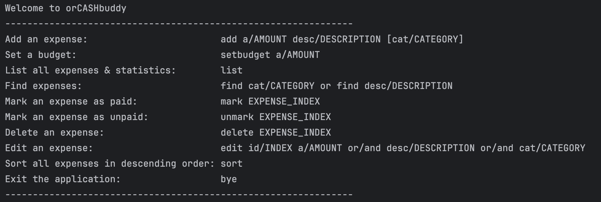

# orCASHbuddy User Guide

Welcome to the user guide for orCASHbuddy, a lightweight command-line assistant for tracking and managing expenses.

orCASHbuddy is designed for Residential College 4 (RC4) Interest Group treasurers who need a quick and reliable way to record spending, set budgets, and monitor group finances.

This document explains how to set up the application, describes every available command, and provides quick references for day-to-day use.

---

## Table of Contents
- [Quick Start](#quick-start)
- [Using This Guide](#using-this-guide)
- [Features](#features)
    - [Viewing Help: `help`](#viewing-help-help)
    - [Adding an Expense: `add`](#adding-an-expense-add)
    - [Editing an Expense: `edit`](#editing-an-expense-edit)
    - [Setting a Budget: `setbudget`](#setting-a-budget-setbudget)
    - [Listing Expenses and Summary: `list`](#listing-expenses-and-summary-list)
    - [Marking an Expense as Paid: `mark`](#marking-an-expense-as-paid-mark)
    - [Unmarking an Expense: `unmark`](#unmarking-an-expense-unmark)
    - [Finding an Expense: `find`](#finding-an-expense-find)
    - [Sorting Expenses by Amount: `sort`](#sorting-expenses-by-amount-sort)
    - [Deleting an Expense: `delete`](#deleting-an-expense-delete)
    - [Exiting the Application: `bye`](#exiting-the-application-bye)
    - [Saving and Loading Data](#saving-and-loading-data)
- [FAQ](#faq)
- [Command Summary](#command-summary)

---

## Quick Start

1. **Install Java 17.** orCASHbuddy requires Java 17 or later. You can verify your version by running `java -version` in your terminal.
2. **Download the application.** Grab the latest `orcashbuddy.jar` from your course release or the project's GitHub Releases page and place it in a convenient folder.
3. **Launch the program.** Open a terminal in the folder containing the JAR and run:
   ```bash
   java -jar orcashbuddy.jar
   ```
   Once the program starts, you’ll see a welcome message and the command menu in your terminal window, as shown below.
   

> **Note:** The application automatically saves your data to a `data` folder. Your expenses and budget will persist between sessions.

---

## Using This Guide

- **Command keywords** (e.g., `add`, `list`) are **case-insensitive**.
- **Placeholders** in `UPPER_SNAKE_CASE` are values you should replace with your own data.
- **Optional parameters** are shown in brackets like `[cat/CATEGORY]`. Do not type the brackets themselves.
- **Amounts** must be positive decimal numbers (e.g., `12.50`). Invalid inputs will display an informative error message.
- **Expense indices** are **1-based** and correspond to the numbering shown by the `list` command.

---

## Features

### Viewing Help: `help`

Displays the command cheat sheet in the terminal.

**Format:** `help`

Use this whenever you need a quick reminder of the supported commands and their prefixes.

---

### Adding an Expense: `add`

Creates a new expense entry with an amount, description, and optional category.

**Format:** `add a/AMOUNT desc/DESCRIPTION [cat/CATEGORY]`

**Parameters:**
- `AMOUNT` — Positive number up to two decimal places (e.g., `12.50`).
- `DESCRIPTION` — Short sentence describing the expense.
- `CATEGORY` (optional) — Tag to group similar expenses. It must start with a letter and can include letters, numbers, spaces, or hyphens (maximum 20 characters). If omitted, the category defaults to `Uncategorized`.

**Examples:**
```
`add a/4.50 desc/Morning coffee`
```
```
`add a/32.90 desc/Weekly groceries cat/Household`
```

The newly added expense appears as `[ ] [CATEGORY] DESCRIPTION - $AMOUNT`. The `[ ]` will switch to `[X]` once the expense is marked as paid.

---

### Editing an Expense: `edit`
Edit the amount and/or the description and/or the category of an expense. Updates the expense list and recalculates the remaining budget.

**Format:** `edit id/INDEX [a/AMOUNT] [desc/DESCRIPTION] [cat/CATEGORY]`

**Parameters:**
- `INDEX` — Positive integer index of the expense in the list.
- `AMOUNT` (optional) — Positive number up to two decimal places (e.g., `12.50`).
- `DESCRIPTION` (optional) — Short sentence describing the expense.
- `CATEGORY` (optional) — It must start with a letter and can include letters, numbers, spaces, or hyphens (maximum 20 characters).

**Notes:**
- You can change multiple attributes of the expense at once.

**Example:** 
```
edit id/1 a/25 desc/pizza
```

---

### Setting a Budget: `setbudget`

Defines your total spending budget for expense tracking and alerts.

**Format:** `setbudget a/AMOUNT`

**Parameters:**
- `AMOUNT` — Your total budget as a positive number

**Example:**
```
setbudget a/500
```

**Expected output:**
```
---------------------------------------------------------------
Your total budget is now $500.00.
---------------------------------------------------------------
```

**What it does:**
- Sets or updates your monthly/weekly budget
- Enables budget tracking in the `list` command
- Triggers alerts when spending approaches or exceeds the budget:
    - **Near threshold:** When remaining balance falls below $10.00
    - **Equal:** When you've used exactly your budget
    - **Exceeded:** When spending goes over budget

**Notes:**
- Setting a new budget **overwrites** the previous value
- The remaining balance recalculates automatically when expenses are marked/unmarked
- Only **marked** expenses count toward your budget usage

---

### Listing Expenses and Summary: `list`
Shows your current budget, total paid expenses, remaining balance, and every recorded expense in the order added.

**Format:** `list`

If you have no expenses yet, orCASHbuddy tells you so and suggests adding one with the `add` command.

---

### Marking an Expense as Paid: `mark`
Flags an expense as settled. Marked expenses contribute to the “total expenses” value displayed by `list`.

**Format:** `mark INDEX`

**Example:**

```
mark 2
```

The index refers to the numbering shown by the most recent `list`. Once marked, the display changes to `[X] [CATEGORY] DESCRIPTION - $AMOUNT`, and the amount counts toward your budget usage.

---

### Unmarking an Expense: `unmark`
Reverts a previously marked expense to unpaid, increasing your remaining balance accordingly.

**Format:** `unmark INDEX`

**Example:** 

```
unmark 2
```

---

### Finding an Expense: `find`
Searches for expenses by category or description keyword, displaying all matching results.

**Format:** `find cat/CATEGORY` or `find desc/DESCRIPTION`

**Examples:**
```
find cat/food
```
- Finds all expenses with categories containing "food"

```
find desc/lunch
```
- Finds all expenses with descriptions containing "lunch"

If no matches are found, orCASHbuddy displays "No expenses found matching [category/description]: [search term]".

**Note:** The numbering in search results (1, 2, 3...) is for display only and does not correspond to the indices used by `mark`, `unmark`, or `delete` commands. Always use `list` to verify the correct index before modifying expenses.

---

### Sorting Expenses by Amount: `sort`
Displays all expenses in descending order of amount (largest first). Sorting does not change the original order used by other commands.

**Format:** `sort`

If there are no expenses to sort, orCASHbuddy will remind you that there are no expenses added yet.

---

### Deleting an Expense: `delete`
Removes an expense permanently (there is no undo). The application rebalances your budget totals automatically.

**Format:** `delete INDEX`

**Example:** 

```
delete 1
```

After deletion, use `list` to confirm the remaining expenses and updated totals.

---

### Exiting the Application: `bye`
Closes orCASHbuddy gracefully.

**Format:** `bye`

You can also terminate the program by closing the terminal window, but using `bye` ensures the farewell message is displayed.

---

### Saving and Loading Data

**Automatic Saving:**
- The application saves your data automatically after every command
- Data is stored in a `data` folder as `appdata.ser`
- You never need to manually save

**Automatic Loading:**
- When you start orCASHbuddy, it automatically loads your previous session
- If no saved data exists, you start with an empty expense list and zero budget

**Data Location:**
- The `data` folder is created in the same directory as `orcashbuddy.jar`
- Do not manually edit or delete `appdata.ser` unless you want to reset all data

**What's Saved:**
- All expenses (amount, description, category, marked/unmarked status)
- Your current budget
- Total expenses and remaining balance

**Notes:**
- If the save file is corrupted or incompatible, you'll start with a fresh session
- The application will notify you if there are any issues loading data

---

## FAQ

**Q: What happens if I mistype a command?**

**A:** orCASHbuddy prints a helpful error message explaining what went wrong (e.g., "Missing prefix 'a/'" or "Amount must be positive"). Read the error, check the command format in the `help` menu, and try again.

---

**Q: Why don't the numbers in `find` results match my list indices?**

**A:** The `find` and `sort` commands renumber results (1, 2, 3...) for easier reading. These numbers are **display-only** and do not correspond to the actual indices used by `mark`, `unmark`, `edit`, or `delete`. Always use `list` first to verify the correct index before modifying expenses.

---

**Q: Can I have multiple expenses with the same description or category?**

**A:** Yes! orCASHbuddy supports duplicate descriptions and categories. Each expense is tracked independently by its position in the list.

---

**Q: What happens if I mark an expense that's already marked?**

**A:** Nothing changes. The expense remains marked, and the command has no effect. The same applies to unmarking an already unmarked expense.

---

**Q: Does deleting an expense change the indices of other expenses?**

**A:** Yes. When you delete an expense, all expenses below it shift up by one position. Always check the current indices with `list` before performing multiple deletions.

---

**Q: What if my remaining balance is negative?**

**A:** orCASHbuddy allows negative balances and will display them as such (e.g., "Remaining balance: $-45.30"). You'll also see a red alert message indicating you've exceeded your budget, along with how much you're over.

---

**Q: Can I change my budget after setting it?**

**A:** Yes! Simply use the `setbudget` command again with a new amount. The new budget overwrites the old one, and your remaining balance is recalculated based on your current marked expenses.

---

**Q: Where is my data stored?**

**A:** Your data is saved in a file called `appdata.ser` inside a `data` folder, located in the same directory as `orcashbuddy.jar`. This file is automatically created when you first add an expense or set a budget.

---

**Q: Do unmarked expenses count toward my budget?**

**A:** No. Only **marked** expenses (shown with `[X]`) count toward your total expenses and affect your remaining balance. Unmarked expenses (shown with `[ ]`) are tracked but don't impact your budget calculations.

---

## Command Summary

| Action | Format | Example |
|--------|--------|---------|
| View help | `help` | `help` |
| Add expense | `add a/AMOUNT desc/DESCRIPTION [cat/CATEGORY]` | `add a/19.99 desc/Notebook cat/School` |
| Edit expense | `edit id/INDEX [a/AMOUNT] [desc/DESCRIPTION] [cat/CATEGORY]` | `edit id/1 a/25 desc/pizza` |
| Set budget | `setbudget a/AMOUNT` | `setbudget a/250` |
| List summary | `list` | `list` |
| Mark as paid | `mark INDEX` | `mark 3` |
| Unmark expense | `unmark INDEX` | `unmark 3` |
| Find expense | `find cat/CATEGORY` or `find desc/DESCRIPTION` | `find cat/food` |
| Sort expenses | `sort` | `sort` |
| Delete expense | `delete INDEX` | `delete 2` |
| Exit | `bye` | `bye` |

---

**For detailed explanations, parameter notes, and expected outcomes, refer to the [Features](#features) section above.**

---

*Last updated: v2.0*
